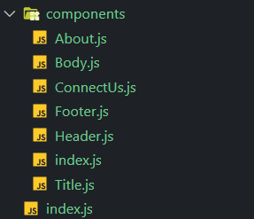
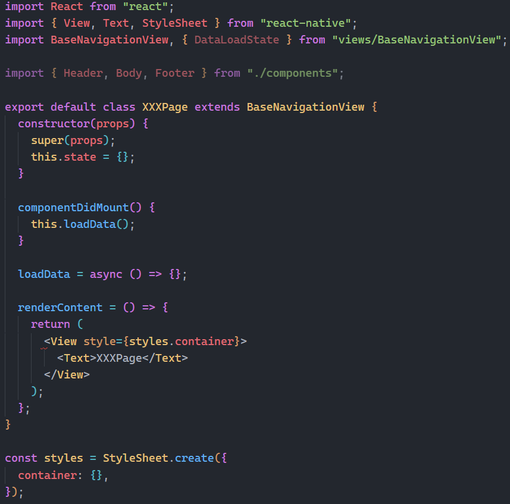
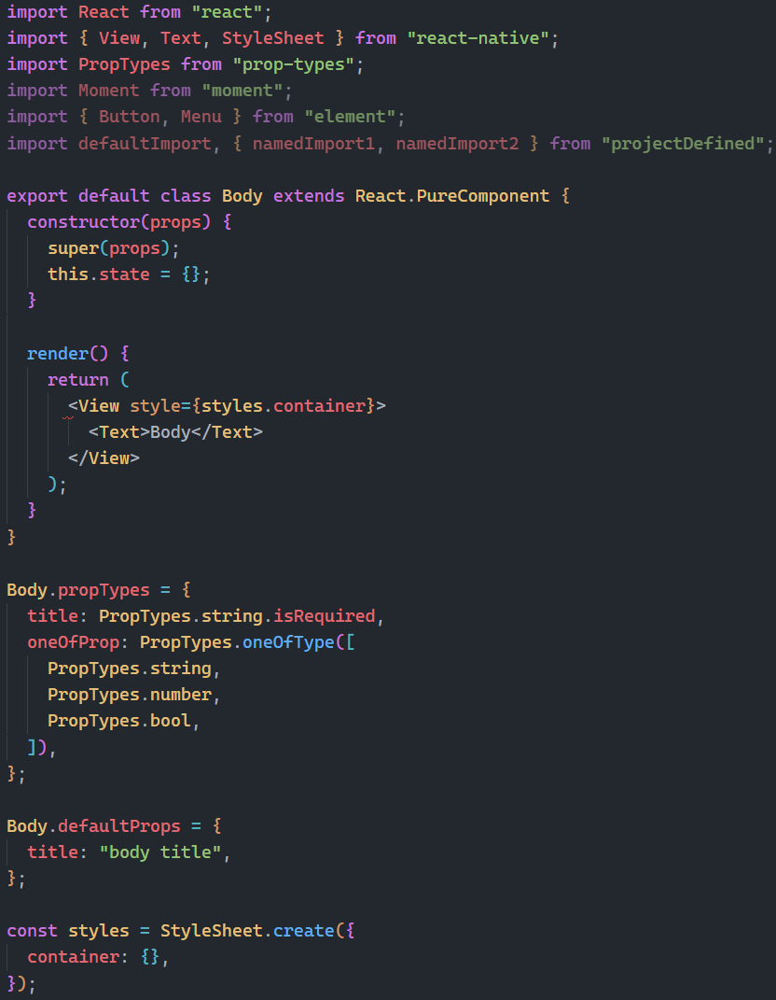
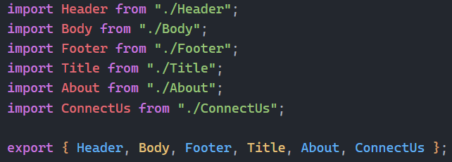

# `j2c-cli`

## 是什么

`j2c-cli`是一个用于生成`react-native`代码的`cli`工具。

## 为什么

我们在使用`react-native`开发前端页面时，通常会这样组织文件结构：新建`XXXPage`文件夹，新建`index.js`作为页面组件，新建`components`文件夹存放该页面的组件，在`components`文件夹中新建`ComponentA.js`，`ComponentA.js`等组件，并新建`index.js`作为入口文件。每个组件中还要引入`react`,`react-native`等基础库，以及`prop-types`来校验`prop`的类型，流程枯燥且繁琐。

`j2c-cli`就是为了解决这个问题诞生的。使用`j2c-cli`，用户通过定义一个表示文件结构和组件信息的对象，就可以生成所需要的文件以及基础的代码框架，包括组件的基础框架，组件依赖的其他组件以及第三方库，组件`props`的类型检查等。

## 怎么用

### 命令

`j2c-cli`提供了两个命令：`j2c config`和`j2c create`。`j2c config`命令用于个性化定义`j2c-cli`的全局配置，`j2c create`用户生成代码。

### `j2c config`

`j2c-cli`提供了两个默认全局配置：用户定义的配置文件名(默认为`j2c.js`)和默认生成的组件类型(`class`组件)

`j2c config`提供了四个子命令：

- `j2c config get <key> <key>` 获取指定配置，不传参数则获取全部配置
- `j2c config set <key=value> <key=value>` 修改全局配置
- `j2c config delete <key> <key>` 删除指定配置
- `j2c config reset <key> <key>` 恢复指定配置默认值，不传参数则恢复全部配置默认值

### `j2c create`

`j2c create`提供了两个选项：

- `--config(-c)` 用于指定配置文件名
- `--type(-t)` 用于指定默认生成的组件类型

### 配置文件

```js
module.exports = {
  name: 'XXXPage', // 组件名 必须
  type: 'view', // 此组件作为页面组件
  components: [
    // 该组件的子组件
    {
      name: 'Header',
      type: 'function', // 函数组件
      props: [
        // 组件的props
        {
          key: 'title', // prop名
          type: 'string', // prop类型
          isRequired: true, // 该porp是否必须
        },
      ],
      components: [
        {
          name: 'Title',
          type: 'class',
          props: [
            {
              key: 'title',
              type: 'string',
              default: 'card Title', // 该prop的默认值
            },
            {
              key: 'subTitle',
              type: 'string',
            },
          ],
        },
      ],
    },
    {
      name: 'Body',
      type: 'class',
      props: [
        {
          key: 'title',
          type: 'string',
          isRequired: true,
          default: 'body title',
        },
        {
          key: 'oneOfProp',
          type: ['string', 'number', 'bool'],
        },
      ],
      libs: [
        // 组件引入的第三方库，或者components文件夹以外的依赖
        {
          name: 'moment', // 库名
          items: [
            // 引入的组件
            {
              name: 'Moment', // 引入的组件名
              importType: 'default', // 该组件的导出方式 默认导出
            },
          ],
        },
        {
          name: 'element',
          items: [
            {
              name: 'Button',
              importType: 'named', // 具名导出
            },
            {
              name: 'Menu',
              importType: 'named',
            },
          ],
        },
        {
          name: 'projectDefined',
          items: [
            {
              name: 'defaultImport',
              importType: 'default',
            },
            {
              name: 'namedImport1',
              importType: 'named',
            },
            {
              name: 'namedImport2',
              importType: 'named',
            },
          ],
        },
      ],
    },
    {
      name: 'Footer',
      type: 'function',
      components: [
        {
          name: 'About',
          type: 'function',
        },
        {
          name: 'ConnectUs',
          type: 'function',
        },
      ],
    },
  ],
};
```

上述配置文件将生成如下目录结构



部分文件如下

`index.js`



---

`components/Body.js`



---

`components/index.js`



用户在组织配置文件时，应当从**文件结构**的角度出发，而不是**组件结构**。

因为对于相同的组件结构，组合模式(`childen`或者`slot`)的使用与否，会导致组件的引入位置发生巨大的变化。

## 后续展望

- 目前`j2c-cli`只支持生成`react-native`代码，未来将支持`react`和`vue`
- 用户编写配置文件过于繁琐，且容易出错，未来支持可视化配置的方式，实现类似`vue ui`的功能
- 扩展代码模板，支持用户自定义模板
